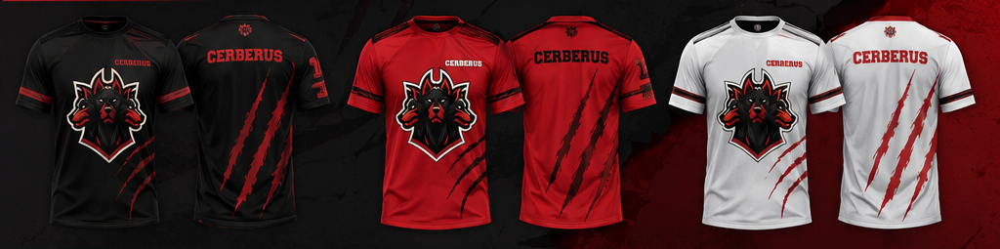

🐺 Cerberus Store

Site oficial da Cerberus Store, desenvolvido para apresentar a coleção de roupas esportivas e streetwear da marca Cerberus.

O projeto foi desenvolvido em HTML, CSS e JavaScript, com uma interface moderna em preto, vermelho e branco, seguindo a identidade visual da Cerberus.

🛍️ Sobre o projeto

A Cerberus Store é uma vitrine digital para produtos esportivos e streetwear.

O site apresenta:

Camisetas Dry Fit

Shorts de treino

Calças de treino

Moletons Street Wear

Conjuntos Streetwear

Bonés

Bandanas

Garrafas

Stickers

Informações sobre a Academia Cerberus

Localização da loja

Avaliações de clientes

Calculadora de tamanho

Avatar 3D para combinação de peças

Atendimento e pedidos pelo WhatsApp

🎨 Identidade visual

O projeto utiliza como cores principais:

Cor

Uso

⚫ Preto

Fundo principal e contraste

🔴 Vermelho

Botões, destaques e identidade da marca

⚪ Branco

Textos e peças claras

A interface foi criada para transmitir uma estética esportiva, urbana e agressiva, alinhada à identidade da Cerberus.

📁 Estrutura do projeto

CerberusStore/
│
├── index.html
├── README.md
├── cerberus-store-original.html
│
└── imagens/
    ├── camiseta-dry-fit.png
    ├── short-treino.png
    ├── calca-treino.png
    ├── moletom-streetwear.png
    ├── conjunto-streetwear.png
    ├── bone.png
    ├── bandana.png
    ├── garrafa.png
    ├── sticker.png
    └── colecao-original.png

index.html

Página principal do site.

Contém a estrutura HTML, estilos CSS e funcionalidades JavaScript do projeto.

imagens/

Pasta que contém as imagens utilizadas na loja.

Os caminhos utilizados no site são relativos, por exemplo:

Isso permite que as imagens funcionem corretamente quando o projeto é publicado no GitHub ou Vercel.

⚙️ Funcionalidades

🛒 Catálogo de produtos

O site apresenta os principais produtos da Cerberus Store, com nome, descrição e preço.

📏 Calculadora de tamanho

O usuário pode informar medidas como:

Altura

Peito/busto

Cintura

O JavaScript calcula uma sugestão de tamanho entre:

P
M
G
GG
XG

O resultado também pode ser enviado para confirmação pelo WhatsApp.

🧍 Avatar 3D

O site possui uma seção de avatar 3D desenvolvida utilizando Three.js, permitindo visualizar combinações de camiseta, calça/short e boné.

💬 WhatsApp

Os principais botões do site direcionam o usuário para o WhatsApp para:

Consultar produtos

Confirmar tamanho

Solicitar preços

Aproveitar ofertas

Entrar em contato com a loja

📍 Localização

O site possui uma seção de localização com mapa incorporado do Google Maps.

🏋️ Academia Cerberus

Também existe uma seção dedicada à integração entre a Store e a Academia Cerberus, incluindo informações sobre benefícios e acesso ao site da academia.

🧰 Tecnologias utilizadas

HTML5

Utilizado para estruturar todas as páginas e seções do site.

CSS3

Responsável pelo:

Layout

Responsividade

Animações

Cores

Tipografia

Cards

Botões

Efeitos visuais

JavaScript

Utilizado nas funcionalidades interativas, incluindo:

Calculadora de tamanho

Avatar 3D

Seleção de cores

Seleção de peças

Interações da página

Three.js

Biblioteca utilizada para renderização do avatar 3D.

Google Fonts

O projeto utiliza as fontes:

Manrope

Inter

🚀 Como executar localmente

Não é necessário instalar um framework ou servidor complexo.

Basta baixar/clonar o projeto e abrir:

index.html

no navegador.

Para uma experiência melhor durante o desenvolvimento, também é possível utilizar o Live Server no Visual Studio Code.

🌐 Publicando no GitHub

Crie um repositório chamado:

CerberusStore

Envie o conteúdo do projeto para o repositório.

Confirme se a estrutura está assim:

index.html
imagens/

Faça o commit.

O GitHub reconhecerá o index.html como página principal quando o projeto for utilizado com GitHub Pages.

▲ Publicando no Vercel

O projeto também pode ser publicado no Vercel.

Passo 1

Entre no Vercel e selecione Add New Project.

Passo 2

Importe o repositório:

CerberusStore

Passo 3

Como o projeto é HTML/CSS/JavaScript puro, não é necessário utilizar um framework.

Passo 4

Clique em Deploy.

Depois da publicação, o Vercel disponibilizará uma URL para o site.

🖼️ Imagens

As imagens dos produtos estão armazenadas localmente dentro da pasta:

/imagens

Evite alterar os nomes dos arquivos sem atualizar os caminhos correspondentes no index.html.

📱 Responsividade

O site foi desenvolvido para funcionar em diferentes tamanhos de tela, incluindo:

💻 Desktop

💻 Notebook

📱 Celular

📱 Tablet

📞 Contato

Os botões de contato do site utilizam o WhatsApp para facilitar o atendimento e a realização de pedidos.

🏋️ Cerberus

Treino pesado. Rua com atitude.

Cerberus Store — roupas de academia e streetwear.

📄 Licença

Este projeto é destinado à utilização da Cerberus Store.

Todos os elementos de marca, logotipo, identidade visual e imagens pertencem aos respectivos proprietários.
